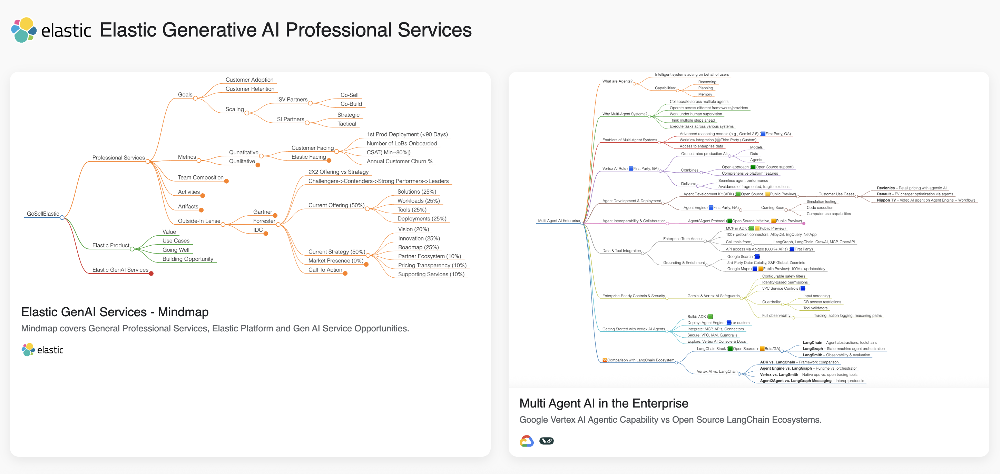

# Elastic Generative AI Professional Services

This repository hosts interactive mindmaps that showcase key concepts in Elastic’s Generative AI offerings and Google's Vertex AI agentic architecture.

---

## 🌐 Live Demo

▶️ **[View Live Site on GitHub Pages](https://genaigeek1.github.io/Elastic/)**  

---

## 🧭 Mindmap Index

### 1. [Elastic GenAI Services Mindmap](docs/Elastic.html)
- Covers:
  - Leading a Professional Services Organization
  - Elastic Platform Architecture
  - Generative AI Service Opportunities
- Source: [`markmaps/Elastic.md`](markmaps/Elastic.md)
- 

### 2. [Multi-Agent AI in the Enterprise](docs/MultiAgentAIEnterprise.html)
- Explores:
  - Google Vertex AI's agentic framework: ADK, Agent Engine, Agent2Agent
  - Comparison with LangChain Ecosystem
- Source: [`markmaps/MultiAgentAI_Enterprise.md`](markmaps/MultiAgentAI_Enterprise.md)
- 

---

## 📜 License
See [LICENSE](LICENSE) for details.
