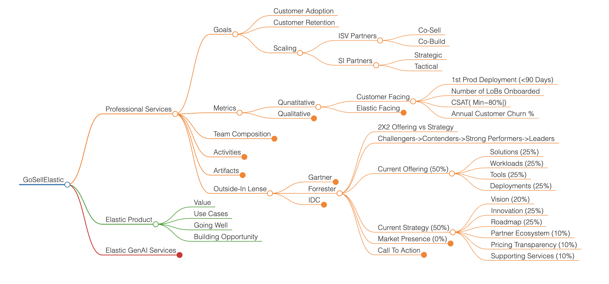
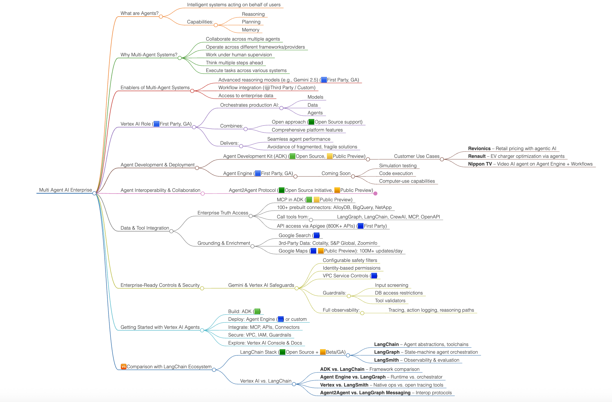

# Elastic AI Mindmaps

This repository contains interactive Markmap-based mindmaps for visualizing key concepts related to Elastic and Vertex AI multi-agent systems.

---

## 🧭 Mindmap Index

### 1. [Elastic Platform Mindmap](docs/Elastic.html)
- Covers Elastic's platform architecture and core capabilities.
- Source: [`markmaps/Elastic.md`](markmaps/Elastic.md)
- 

### 2. [Multi-Agent AI in the Enterprise](docs/MultiAgentAIEnterprise.html)
- Explores Vertex AI's multi-agent architecture with ADK, Agent Engine, and Agent2Agent Protocol.
- Source: [`markmaps/MultiAgentAI_Enterprise.md`](markmaps/MultiAgentAI_Enterprise.md)
- 

---

## 📜 License
See [LICENSE](LICENSE) for details.
