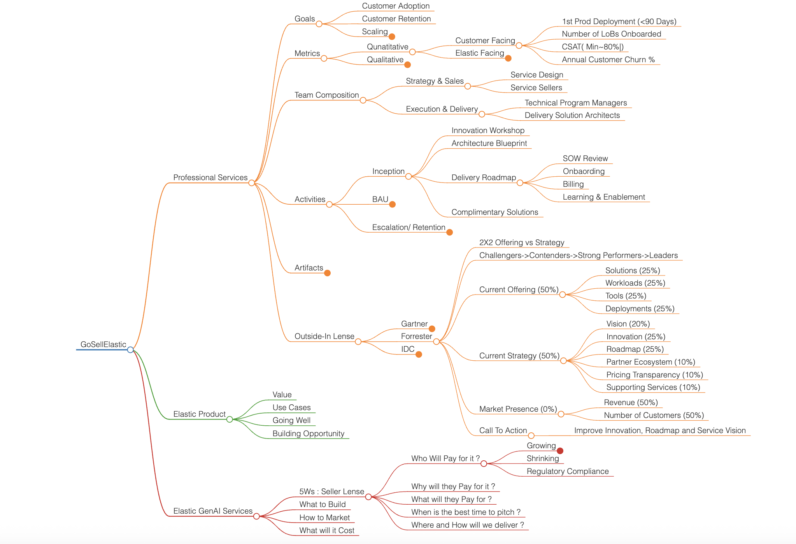

# Elastic Gen AI Service Mindmaps

This repository contains interactive Markmap-based mindmaps for visualizing key concepts related to Elastic and Vertex AI multi-agent systems.

---

## 🧭 Mindmap Index

### 1. [Elastic GenAI Services Mindmap](docs/Elastic.html)
- Covers
  - Leading a PSO Org
  - Elastic Platform Architecture
  - GenAI Services : Thought Leadership
- Source: [`markmaps/Elastic.md`](markmaps/Elastic.md)
- 

### 2. [Multi-Agent AI in the Enterprise](docs/MultiAgentAIEnterprise.html)
- Explores
  - Vertex AI's multi-agent architecture with ADK, Agent Engine, and Agent2Agent Protocol.
  - Contrasts with Langchain Ecosystem
- Source: [`markmaps/MultiAgentAI_Enterprise.md`](markmaps/MultiAgentAI_Enterprise.md)
- 

---

## 📜 License
See [LICENSE](LICENSE) for details.
